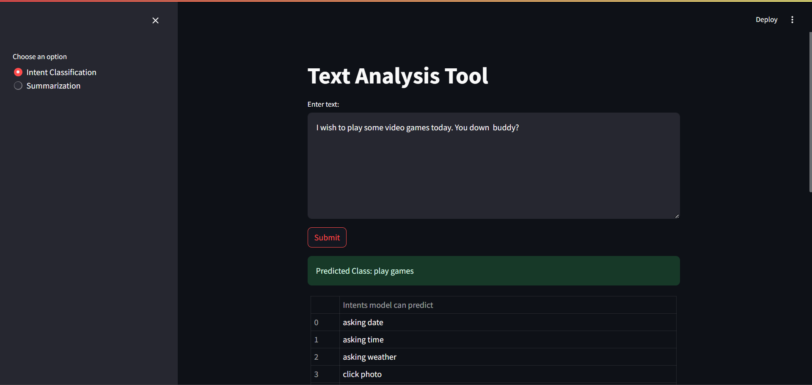
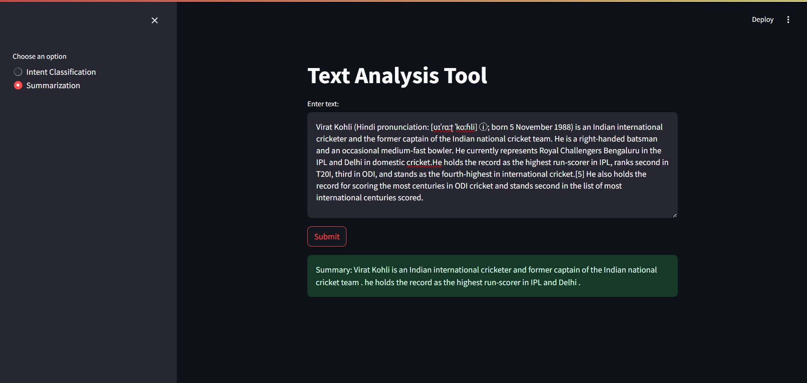

# DistilBERT and T5 Model Finetuning Project

This project involves fine-tuning and quantizing two models: `DistilBERT` for intent recognition and `T5-small` for summarization. The intent recognition model has been fine-tuned on a dataset with 22 different classes and quantized to int8. The summarization model has been fine-tuned on the CNN news dataset. The project includes a web application with both a Flask API and a Streamlit interface to use these models.

Both models have been quantized to int8 using ONNX. After fine-tuning, the size of the DistilBERT model was **255 MB**, and it was reduced to `65 MB` after quantization. For the T5-small model, the fine-tuned size was **230 MB**, and after quantization, the sizes of the encoder, decoder, and decoder_with_past_model files were `33 MB`, `52 MB`, and `57 MB`, respectively.

## Table of Contents

- [Setup and Installation](#setup-and-installation)
- [Dataset](#dataset)
- [Model Training](#model-training)
- [Model Quantization](#model-quantization)
- [Running the Web Application](#running-the-web-application)
- [Usage](#usage)
- [Project Structure](#project-structure)
- [Results](#results)

## Setup and Installation

1. **Create a Virtual Environment:**

    ```bash
    python -m venv .venv
    ```

2. **Activate the Virtual Environment:**

    - On Windows:
        ```bash
        .\.venv\Scripts\activate
        ```
    - On macOS and Linux:
        ```bash
        source .venv/bin/activate
        ```

3. **Install the Necessary Packages:**

    ```bash
    pip install -r requirements.txt
    ```

## Dataset

The dataset is already provided in the `dataset` directory. The directory structure is as follows:

```plaintext
dataset/
├── cnn_news_dataset/
│   └── cnn_dataset.csv
└── intent_recognition_dataset/
    ├── train.csv
    └── val.csv
```
## Model Training

### DistilBERT for Intent Recognition

1. **Fine-tuning:**

    Use the notebook `distilbert_finetuned_intent_recognition.ipynb` located in the `notebook/model_training` directory to fine-tune the `DistilBERT` model.

    ```bash
    jupyter notebook notebook/model_training/distilbert_finetuned_intent_recognition.ipynb
    ```

2. **Quantization:**

    Use the notebook `distilbert_quantization.ipynb` in the `notebook/quantization_notebooks` directory to quantize the fine-tuned model to int8.

    ```bash
    jupyter notebook notebook/quantization_notebooks/distilbert_quantization.ipynb
    ```

### T5 for Summarization

1. **Fine-tuning:**

    Use the notebook `T5_small_finetuned_summary_generation.ipynb` located in the `notebook/model_training` directory to fine-tune the `T5-small` model.

    ```bash
    jupyter notebook notebook/model_training/T5_small_finetuned_summary_generation.ipynb
    ```

2. **Quantization:**

    Use the notebook `seq2seq_finetuned_t5_model_quantization.ipynb` in the `notebook/quantization_notebooks` directory to quantize the fine-tuned model.

    ```bash
    jupyter notebook notebook/quantization_notebooks/seq2seq_finetuned_t5_model_quantization.ipynb
    ```

## Running the Web Application

### Flask API

1. Navigate to the `webapp/flask_api` directory in terminal:

    ```bash
    cd webapp/flask_api
    ```

2. Run the Flask API:

    ```bash
    python app.py
    ```

### Streamlit App

1. Navigate to the `webapp/streamlit_app` directory in new terminal:

    ```bash
    cd webapp/streamlit_app
    ```

2. Run the Streamlit app:

    ```bash
    streamlit run app.py
    ```

## Usage

- **Intent Recognition**:

    To classify the intent of a piece of text, you can send a POST request to the Flask API with the text you want to classify. The API will process the text and return the predicted class.

- **Summarization**:

    To generate summary of input text you can send a POST request to the Flask API for summarization. The API will process the text and return a summarized output.

Both the intent recognition and text summarization functionalities have endpoints accessible via POST requests, and both are seamlessly integrated into the Streamlit frontend interface for user interaction.

## Project Structure

```plaintext
distilbert_x_t5/
├── .venv/
├── dataset/
│   ├── cnn_news_dataset/
│   │   └── cnn_dataset.csv
│   └── intent_recognition_dataset/
│       ├── train.csv
│       └── val.csv
├── finetuned_distil_bert_quantint8/
│   ├── quantint_model/
│   └── tokenizer/
├── finetuned_T5_quantint8/
│   ├── quantint_model/
│   └── tokenizer/
├── notebook/
│   ├── model_training/
│   │   ├── distilbert_finetuned_intent_recognition.ipynb
│   │   └── T5_small_finetuned_summary_generation.ipynb
│   └── quantization_notebooks/
│       ├── distilbert_quantization.ipynb
│       └── seq2seq_finetuned_t5_model_quantization.ipynb
├── webapp/
│   ├── flask_api/
│   │   ├── __pycache__/
│   │   ├── __init__.py
│   │   ├── app.py
│   │   ├── config.py
│   │   └── model.py
│   └── streamlit_app/
│       ├── __init__.py
│       └── app.py
├── .gitattributes
├── .gitignore
├── README.md
├── requirements.txt
└── results.png
```

## Results

<div style="display: flex; justify-content: center;">
    <figure style="margin-right: 20px;">
        
        <figcaption style="text-align: center;">Intent recognition demo</figcaption>
    </figure>
    <figure style="margin-left: 20px;">
        
        <figcaption style="text-align: center;">Text summarization demo</figcaption>
    </figure>
</div>


## Notes
- Ensure that all paths are correct when running scripts and notebooks. Adjust paths if necessary to match your project's directory structure.

- Double-check the path to the datasets and models to avoid path errors during execution.